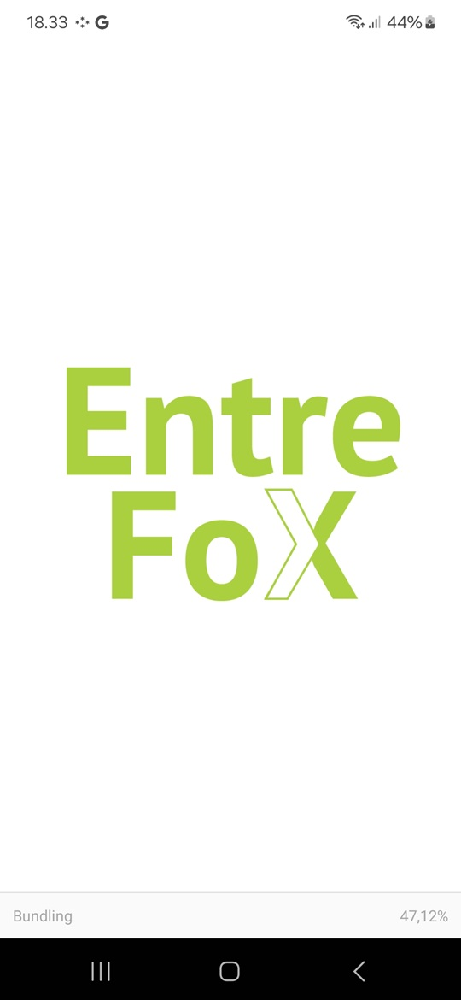
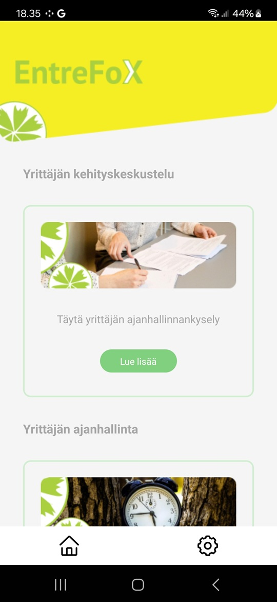
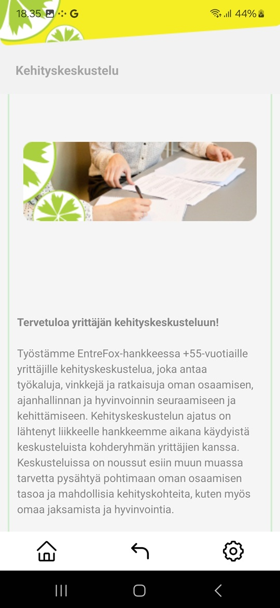
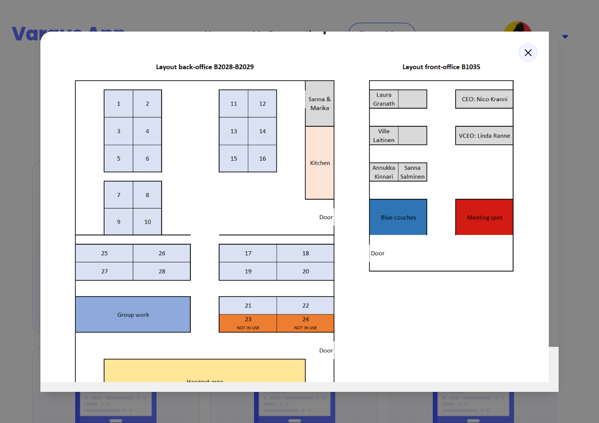
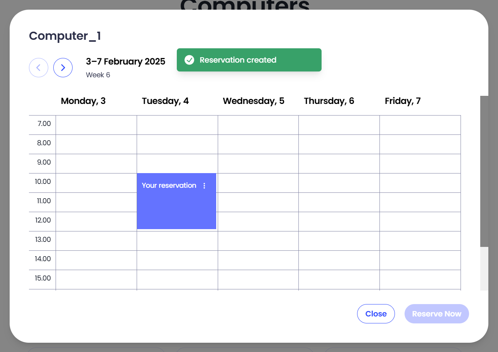
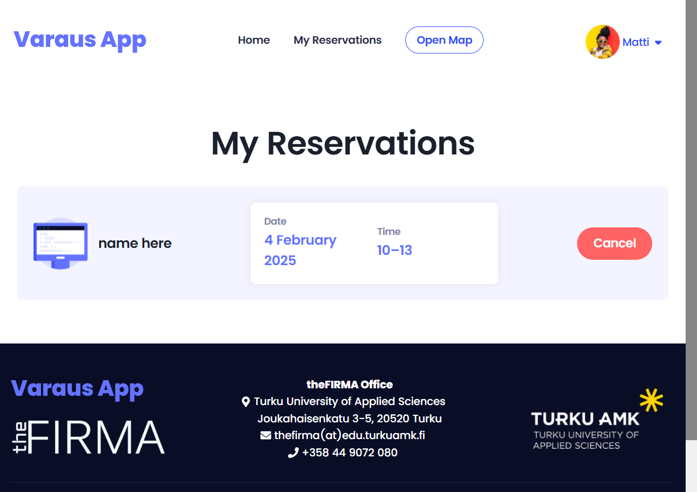
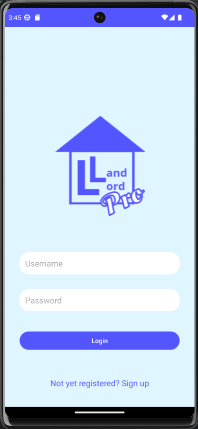
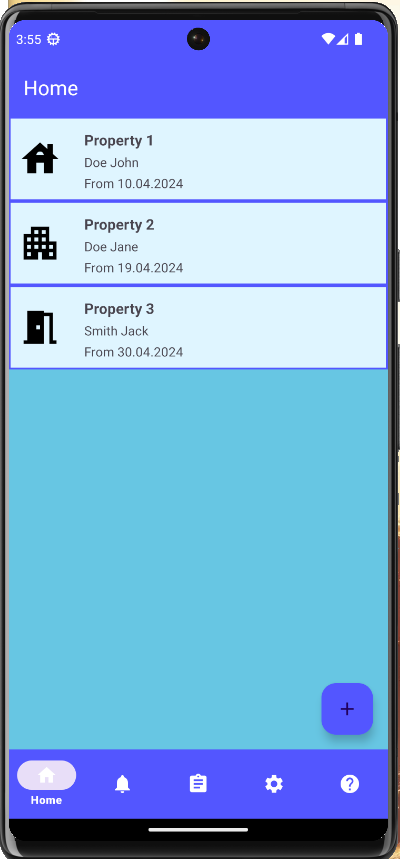
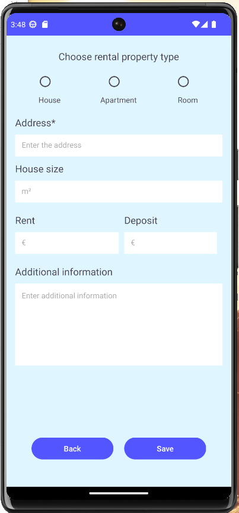
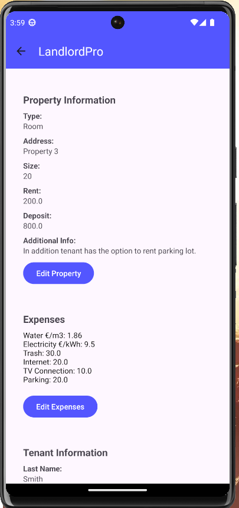

## Portfolio

Welcome to my portfolio! Here you can find a selection of projects I’ve developed, demonstrating my skills in full-stack development, React Native, and more.

---

## Projects

### 1. [EntreFox App](./entrefox_app)
Cross-platform mobile application built with **React Native** to support entrepreneurship, featuring questionnaires and form management. 

**Overview:**  
Originally a legacy project, I restored its functionality and added a language switch feature (Finnish & English) to improve accessibility.  

**Highlights:**  
- Dockerized for easy setup.  
- Runs on Android emulator or real device with Expo.  

**My Role:**  
✔️ Restored the existing application functionality  
✔️ Added multi-language support (FI & EN)  
✔️ Ensured smooth performance on Android and iOS

**Technologies Used:**  
- Frontend: React Native, Expo  
- Development Tools: Android Studio, Docker

**Key Features:**  
✔️ Multi-language support (FI, EN)  
✔️ Mobile-friendly UI with Expo  
✔️ Configurable environment with Docker

**Screenshots:**  
  
  

**Run Instructions:** See [README in the `entrefox_app` folder](./entrefox_app/README.md) for detailed setup.

---

### 2. [Varausapp](./varausapp)
Web application for reserving computers and meeting spaces at theFirma. Built with React on the frontend and Node.js/Express/MongoDB on the backend.

**Overview:**
Developed as a student project, VarausApp provides a clean, interactive interface for students to check availability and make reservations.

**My Role:**
✔️ Responsible for most of the frontend development
✔️ Built responsive UI with React + Chakra UI
✔️ Integrated React Router for navigation
✔️ Set up Docker for easy local development and deployment

**Highlights:**  
-Backend built by using Node.js, Express, and MongoDB
-Interactive booking interface
-Real-time availability updates

**Technologies Used:**
-Frontend: React, React Router, Chakra UI
-Backend: Node.js, Express.js, MongoDB

**Screenshots:**  
  
  
  
  

 
**Run Instructions:** See [README in the `varausapp` folder](./varausapp/README.md) for detailed setup.

---

### [LandLordPro](./landlordpro/)

**Overview:**

LandLordPro is an Android application designed to help vietnamese landlords efficiently manage properties and tenants. The app provides tools for tracking rent payments, viewing tenant information, and managing property details in a clean, intuitive interface.

The project was developed as my functional thesis, motivated by inefficiencies observed in property management practices during a visit to Vietnam. The goal was to create a modern, user-friendly solution tailored to the specific needs and behaviors of property owners in Vietnam.

**My Role:**

✔️ Entire development of the Android app (functional thesis)
✔️ Designed the user interface and navigation flow
✔️ Implemented all core functionalities, including tenant/property management and rent tracking
✔️ Managed database setup with SQLite
✔️ Ensured smooth and responsive app performance
✔️ Prepared the app for potential future cloud migration to Firebase

**Technologies Used:**

-Frontend/Android: Kotlin, Android Studio
-Database: SQLite (local storage on device)
-Build System: Gradle

**Highligths:**
-View and manage a list of properties and tenants
-Track rent payments and due dates
-Add, edit, and delete property and tenant information
-Simple, user-friendly interface

**Screenshots**

  
  
  
  

**Run Instructions:** See [README in the LandLordPro repository](https://github.com/Jonttufantti/LandLordPro/blob/main/README.md)
for detailed setup.
